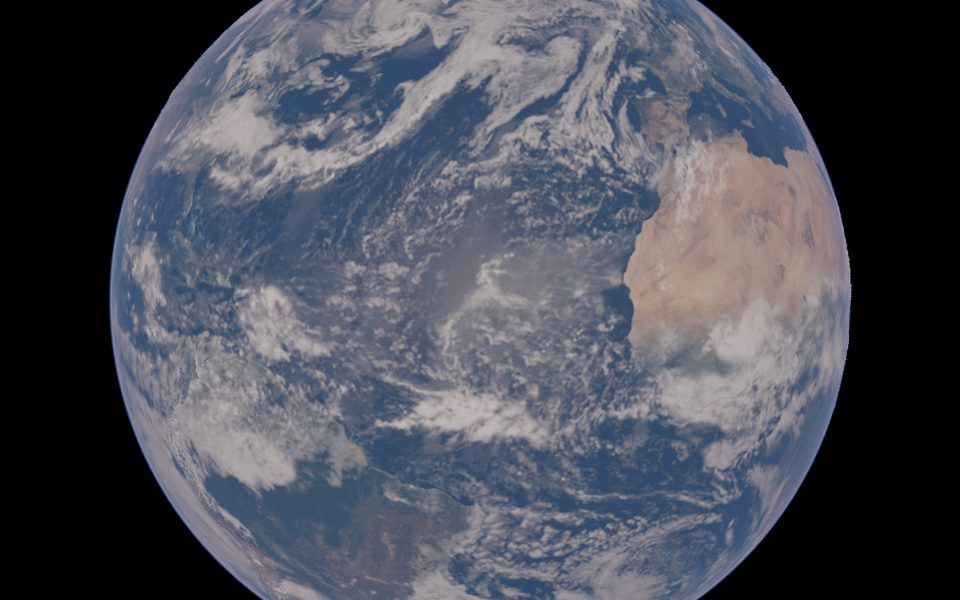
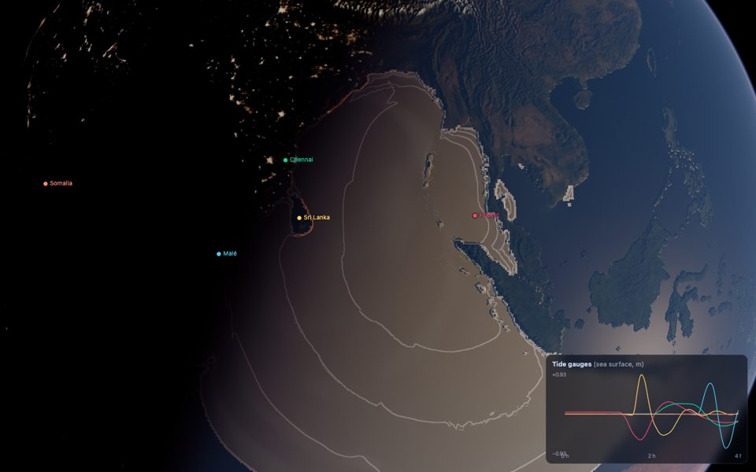
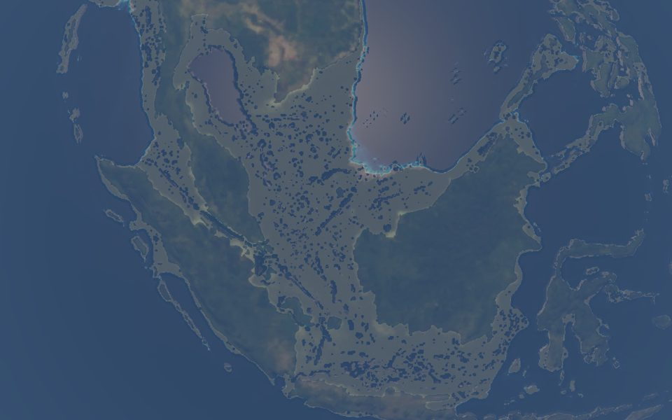
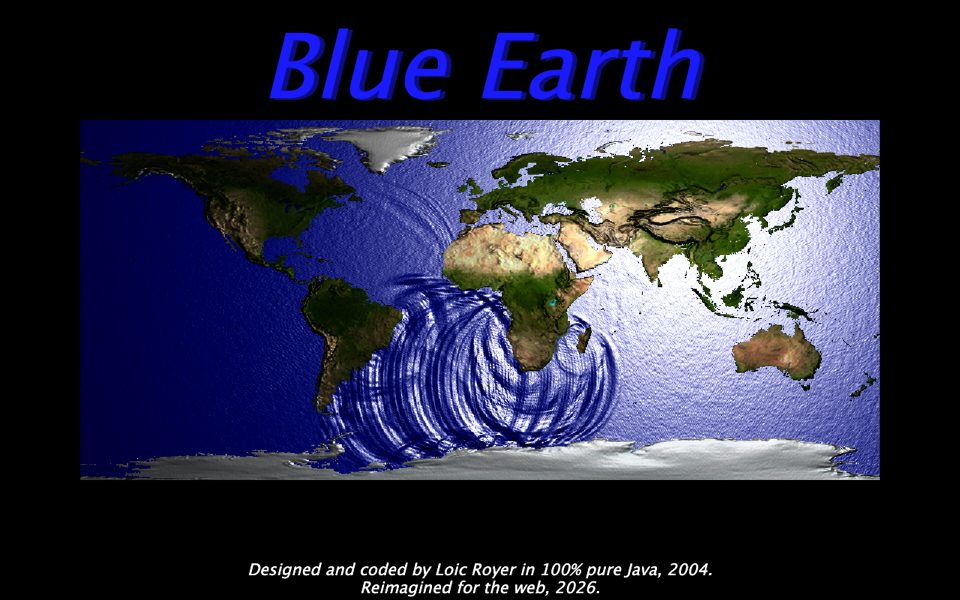

# Blue Earth

A physically based, real-time web remake of *Blue Earth*, Loic Royer's 2004 Java ripple and tsunami demo.



- **Real ocean physics on the GPU.** Nonlinear shallow-water equations on an equiangular cubed sphere
  (1.6 M cells) over real bathymetry (ETOPO 2022). Waves travel at √(g·depth), refract over ridges,
  reflect off coasts and flood low land. The ocean at rest stays exactly at rest (float32-exact).
- **Sea level from Ice Age to ice-free.** −120 m exposes Sundaland and Doggerland (with the Baltic and
  Black Sea as relict lakes); +70 m drowns the coastal plains. Connectivity comes from a flood-level map,
  so the Caspian and the Dead Sea behave.
- **Historical tsunamis.** 2004 Sumatra, 2011 Tōhoku, 1960 Valdivia and more, from simplified Okada
  fault sources (validated against Okada's DC3D). Modelled arrival times match observations;
  maximum-height and arrival-time maps; virtual tide gauges.
- **Beautiful.** Bruneton/Hillaire atmosphere (takram), Cox–Munk sun glint, depth absorption, foam,
  monthly Blue Marble imagery, city lights, clouds, AgX tone mapping, a chunked-LOD globe.
- **The original, bit-exact.** *Classic 2004* mode runs the 2004 algorithm on the GPU, pixel-identical
  to the Java original (checked against frames produced by the original code).

| Sumatra 2004, arrival isochrones | Ice Age (−120 m) | Classic 2004 |
|---|---|---|
|  |  |  |

## Run
```sh
npm install
(cd pipeline && uv sync && uv run python -m blueearth_pipeline.build)   # ~2 min: downloads ~1.2 GB of data, builds public/data
npm run dev                                                           # http://localhost:5173
```
Needs WebGPU (Chrome/Edge, Safari 26, Firefox 141+ on Windows/macOS). Other browsers fall back to
WebGL2, which also runs the full simulation. The High tier needs `... build high` (~3 min).

## Controls (globe)
| Input | Action |
|---|---|
| drag / wheel | orbit / zoom |
| click | drop a wave · **hold** = oscillating source |
| Shift+move | steer the sun (glint under the cursor); **R** = real sun |
| K | Classic controls (pointer = sun, right-drag = orbit) |
| G | tide gauge at the cursor |
| L | copy a shareable link · **I** about & credits |
| H | hide the panel · **Space** fullscreen · **C** Classic 2004 (and back) |

URL options: `preset=sumatra2004|tohoku2011|valdivia1960|alaska1964|maule2010|cascadia|asteroid`,
`S=<sea level m>`, `date=<ISO>`, `lat/lon/alt` (km), `warp`, `overlay=1|2`, `intro=0`, `kiosk=1`, `hud=0`,
`tier=low|medium|high`, `backend=webgl2`.

## Tests
```sh
npm test                      # unit: numerics, Okada vs DC3D, cube geometry, bit-exact Classic port…
npx playwright test           # GPU: solver parity, lake at rest, Sumatra arrivals, visual baselines…
npm run test:prod             # app tests against the production build
(cd pipeline && uv run pytest)
tools/java-golden/run.sh      # regenerate the Classic 2004 golden frames from the original Java
GPU=linux npx playwright test # on a Linux box with a real GPU (Vulkan)
```

## Docs
[PLAN](docs/PLAN.md) · [ARCHITECTURE](docs/ARCHITECTURE.md) · [NUMERICS](docs/NUMERICS.md) ·
[DATA & attribution](docs/DATA.md) · [PRESETS](docs/PRESETS.md) · [PERF](docs/PERF.md) · [M0 spikes](docs/M0-SPIKES.md)

## Licence
Code: MIT ([LICENSE](LICENSE)). Data: NASA, NOAA NCEI and Natural Earth, public domain or
attribution-only; see [docs/DATA.md](docs/DATA.md). Not for hazard assessment: simplified physics
and sources, exaggerated vertical scales.
